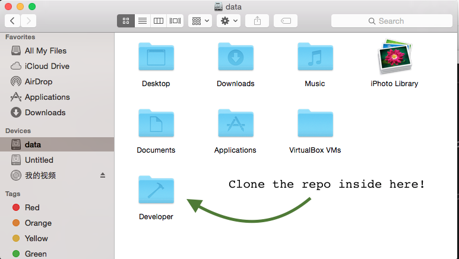
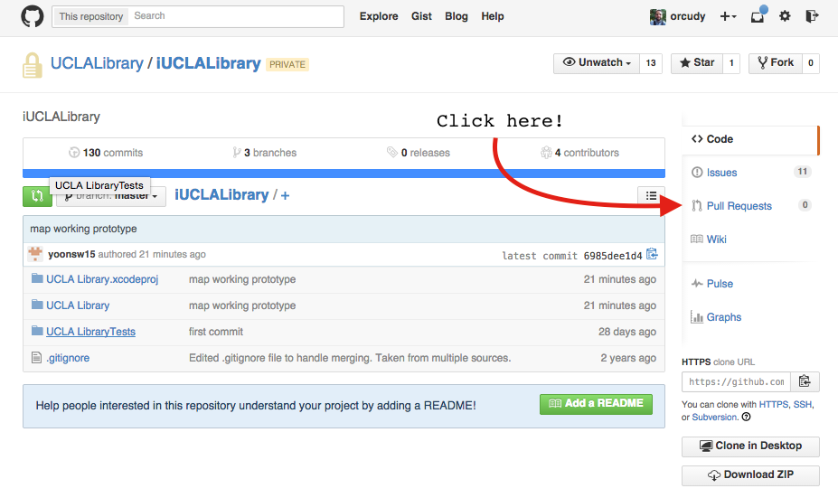
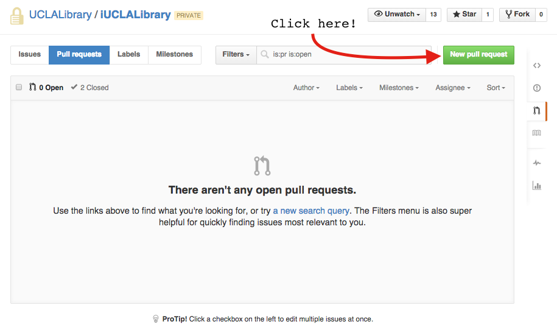
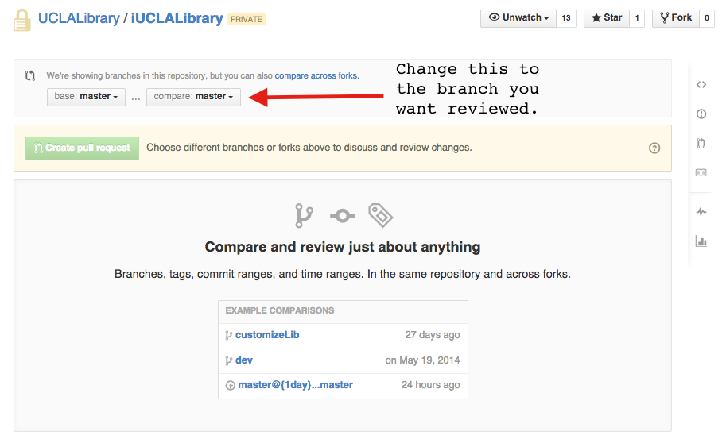
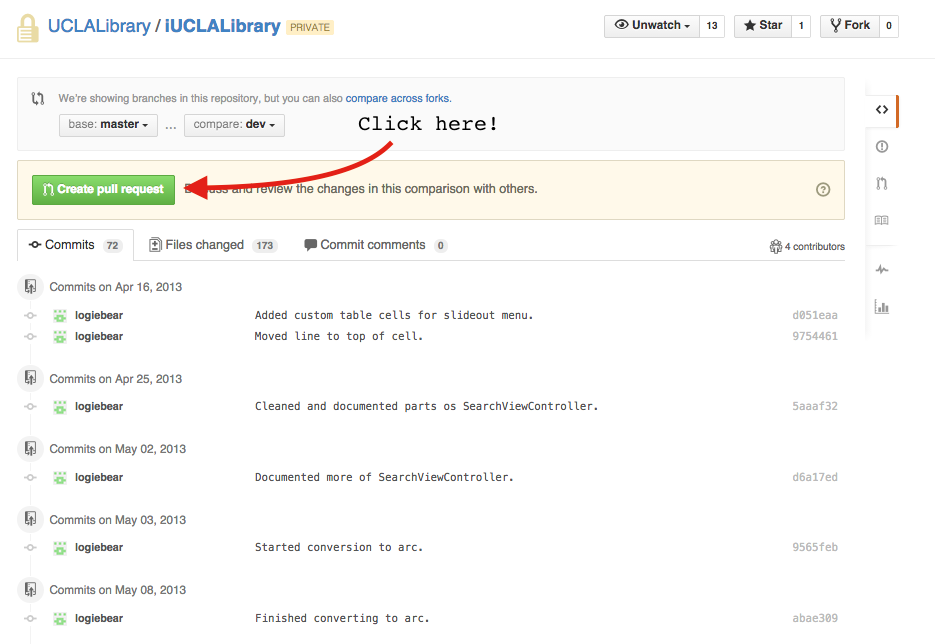
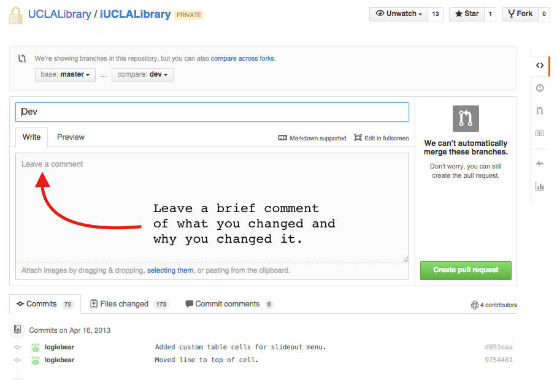
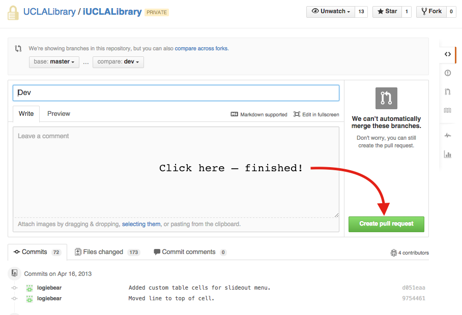

####Setting Up Your Work Space
1. If you havent already, create an account on [GitHub](https://github.com/join), then request permission to access our private repositories by contacting your team lead.
2. Create a *Developer* directory in your *home* directory. To do this from the command line, open **Terminal** and run the following:

  ```bash
  $ cd ~
  $ mkdir Developer
  ```

  This will create the following directory.

  

3. To clone a project, in **Terminal**, run the following:
  ```bash
  $ cd ~/Developer
  $ git clone git@github.com:<repository_name>/<project_name>.git
  ```

  For instance, to clone the **UCLA Library App** project you would run:  
  ```bash
  $ git clone git@github.com:orcudy/UCLALibrary.git
  ```

#### Workflow
On the iOS team, we utilize the git [Feature Branch Workflow](https://www.atlassian.com/git/tutorials/comparing-workflows/feature-branch-workflow). Briefly, this means that the `master` branch will always contain a stable build, and all feature development happens on separate branches.

To begin working on a new feature, or for bug fixes, navigate to the directory which contains your project and run the following:

  ```bash
  $ git pull #to pull the most recent version of the project from GitHub
  $ git checkout -b <branch_name> # to create a new development branch
  ```
  All branches should be named using the following format:

  - \<**initials**\>-\<**issue number**\>-\<**issue name**\>
  - For example, **CO-3-inertial-scrolling**

Now that you have created (and switched) to a new development branch, you can get started fixing the bug or implementing the new feature. **After each work session, commit all of your changes locally!** To do this, navigate to the directory which contains your project and run the following:

  ```bash
  $ git add --all . #this stages all of the changes in your current directory to be committed
  $ git commit -m <commit_message> #this locally commits everthing that was previously staged
  ```
  - *Note: The above commit style works well for very short commit messages; however, to maintain a high quality code base, check out [these tips](http://robots.thoughtbot.com/5-useful-tips-for-a-better-commit-message) on writing good commit messages.*

When the bug has been fixed or feature has been implemented (**and TESTED**), you are ready to push your development branch to GitHub to be reviewed. To do this, navigate to the directory which contains your project and run the following (make sure you add and commit all of your changes locally first):

  ```bash
  $ git push -u origin <branch_name>
  ```

  If the development branch is viewable in GitHub, you are ready to **submit a pull request**! To do this, open GitHub, navigate to the project page, and follow the directions below:

  

  

  

  

  

  

  If you have questions about Git, GitHub, or have any comments about this documentation, please contact Chris Orcutt (orcutt.chris@gmail.com)
