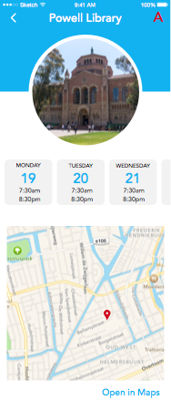
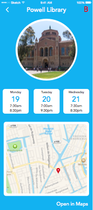
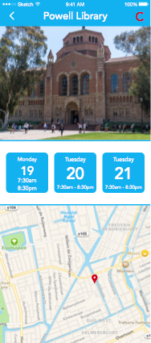

 
Originally authored by Chris Orcutt (orcutt.chris@gmail.com) on August 1, 2015

##Goal
To determine the best of the following interfaces for displaying detailed information about each library:

Interface A                |  Interface B              |    Interface C
:-------------------------:|:-------------------------:|:-----------------:
 |  | 

##Targeted Users
The poll was targeted at current UCLA students, and was ran on the following FaceBook groups:

* *UCLA Class of 2016*
* *Official UCLA Class of 2017*
* *UCLA Class of 2018 Official Group*
* *UCLA Class of 2019*

##Method
The following was posted to the above mentioned FaceBook groups on July 22, 2015 (results gathered on August 1, 2015):

*Hey folks, I would love some feedback on these interfaces for the official UCLA library app! Comment the letter of your favorite (letters located in the upper right of each screenshot) =]*

Interface A                |  Interface B              |    Interface C
:-------------------------:|:-------------------------:|:-----------------:
 |  | 

##Results
####UCLA Class of 2016
* Comments - 50
* Likes - 6
* A - 11
* B - 7
* C - 33
* Participants - 51

####Official UCLA Class of 2017
* Comments - 31
* Likes - 2
* A - 11
* B - 5
* C - 9
* Participants - 25

####UCLA Class of 2018 Official Group
* Comments - 31
* Likes - 6
* A - 11
* B - 2
* C - 18
* Participants - 31

####UCLA Class of 2019
* Comments - 90
* Likes - 13
* A - 27
* B - 20
* C - 43
* Participants - 90

####Total
* Comments - 202
* Likes - 27
* A - 60 (30.5 %)
* B - 34 (17.3 %)
* C - 103 (52.3 %)
* Participants - 197

####Student Comments
* **Lilly An**: C, but the Monday on C is different than the Tuesday and Wednesday! I think the format with the bigger date and single line open/close time is better

* **Shree Dhamija**: Make the gray more prominent behind the dates to make them stand out more

* **Roberto Rodriguez**: C... Maybe take off those two blue lines surrounding top of the map and bottom of the photo.

* **Kushal Mohnot**: A, but try showing a few people the same ones in a different order, I think the results would be different.

* **Chloe Hourdequin**: B it's easier to read with the blue contrasting with the white smile emoticon

##Conclusion
Interface C was voted the best -- we will continue interating on interface C, testing the following:

* different library hour tiles (perhaps using the tiles from interface A)

* changing/removing the borders (thin blue lines) between sections
