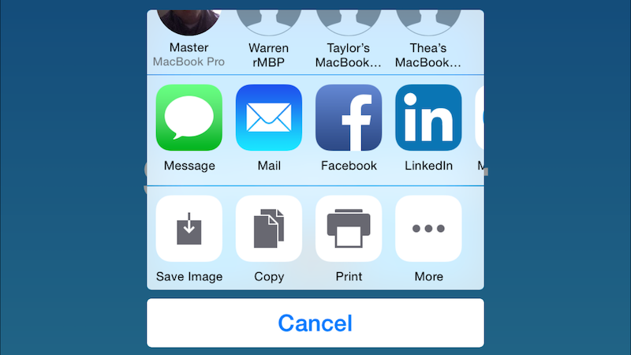

This repo contains sample code for implementing a share button using SpriteBuilder and Swift. 

When the share button is tapped, a number of options for sharing are available (these are set by user). When a user chooses to share, the message will be pre-populated with default text and a screenshot.

