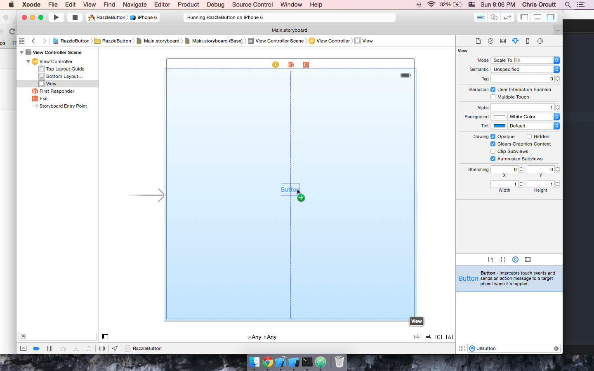
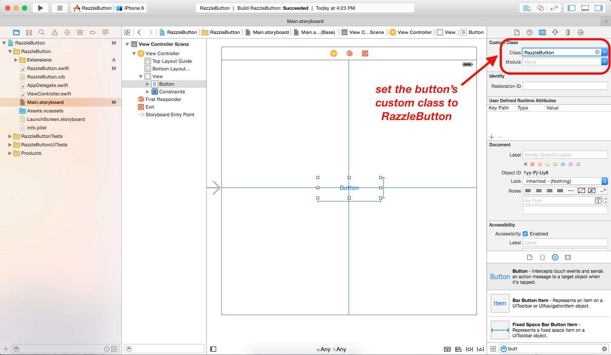
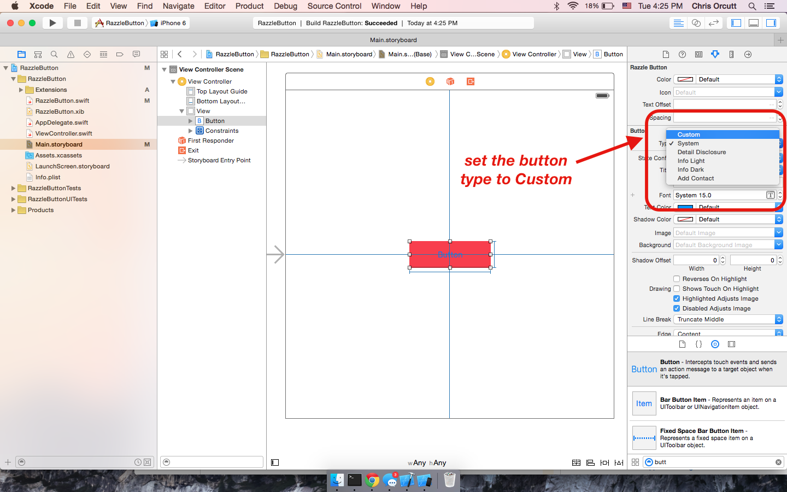
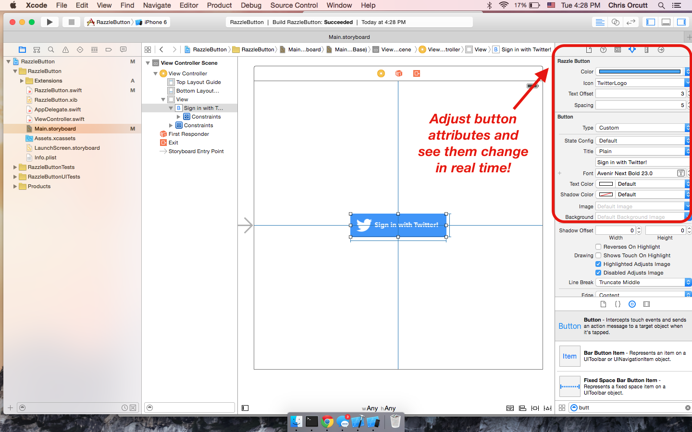

## RazzleButton

RazzleButton provides a beautiful and easy to use button for iOS applications.

### Installing RazzleButton

Eventually, RazzleButton will be integrated into the Razzle framework; in the meantime, you will have to download the RazzleButton project and add the following source files to your project:

* RazzleButton.swift
* RazzleButton.xib
* Extensions/

### Using RazzleButton

Using RazzleButton is incredibly easy:

1. Drag a `UIButton` from the Object Library in Xcode

2. Set the **Class** of the button to *RazzleButton*

3. Set the **Type** of the button to *Custom*

3. Adjust attributes to your liking!

### Release Notes

* RazzleButton breaks when instantiated programmatically.

### Contributing

Open a PR with any comments, suggestions, or bugs!
