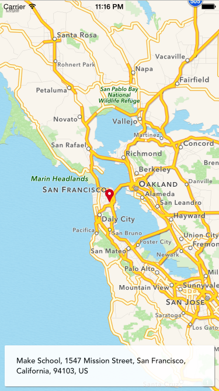
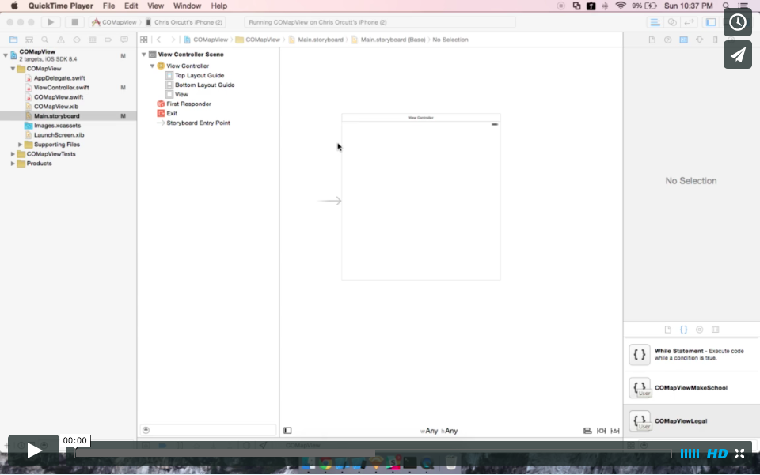

## COMapView

COMapView is a UIView subclass that gives you a slick map with some cool features. (All you have to do is give it data!)




##Features

* resizeable (autolayout friendly)
* stationary footer
* click to open Apple maps
* custom annotation

##Setup

####Interface Builder
1. Ensure you have an image called *Marker* in your image asset catalog. (If you dont, you will not be able to see the map annotation.)
2. Watch the video:

[](https://vimeo.com/137106260)

####Programmatically
1. Ensure you have an image called *Marker* in your image asset catalog. (If you dont, you will not be able to see the map annotation.)
2. See below:
```swift
  var customMapView: COMapView!
  override func viewDidLoad() {
    super.viewDidLoad()

    let frame = CGRect(x: 0, y: 0, width: 300, height: 300)
    customMapView = COMapView(frame: frame)
    view.addSubview(customMapView)

    customMapView.latitude = 37.773078
    customMapView.longitude = -122.418188
    customMapView.span = 1.0

    customMapView.name = "Make School"
    customMapView.street = "1547 Mission Street"
    customMapView.city = "San Francisco"
    customMapView.state = "California"
    customMapView.ZIP = "94103"
    customMapView.country = "US"
  }

  //IMPORTANT: Your app will be rejected from the App Store, unless you add the following:
  override func viewDidAppear(animated: Bool) {
    super.viewDidAppear(true)
    let attributionLabel = customMapView.mapView.subviews[1] as! UILabel
    let mapOrigin = customMapView.mapView.frame.origin
    let padding: CGFloat = 10
    attributionLabel.frame.origin = CGPoint(x: mapOrigin.x + padding, y: mapOrigin.y + padding)
  }
```

####Note on Marker Image
You can find the image used in the demos, in the Assets folder of this repository.

####Note on viewDidAppear()
The code in ViewDidAppear is absolutely necessary, because, without it, the small "Legal" button built into all Apple maps is blocked. The code moves the button to the top left of the MKMapView, instead on the bottom left.
